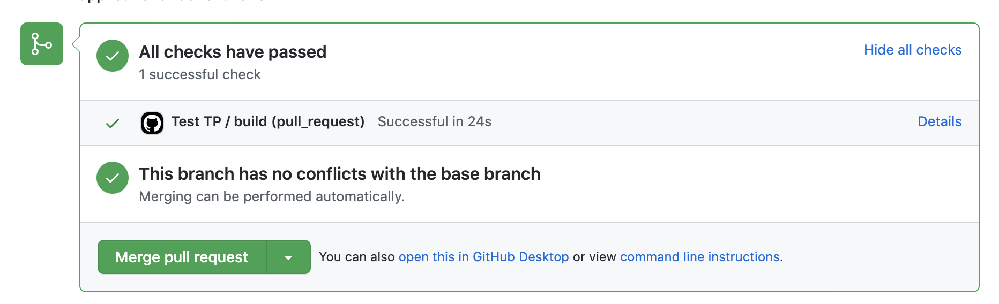

# Solution for Building a Data System with Airflow
[](https://airflow.apache.org/)
[](https://www.python.org/)
[](https://www.postgresql.org/)
[](https://pytest.org/)
[](https://superset.apache.org/)
[](https://www.docker.com/)

The goal of this practice is to build a system that logs the daily price of different stocks.

## Exercise 1

The first thing we have to do is downloading the official `docker-compose` YAML file, obtained from here: 
https://airflow.apache.org/docs/apache-airflow/stable/start/docker.html#docker-compose-yaml, by running teh following:
```
curl -LfO 'https://airflow.apache.org/docs/apache-airflow/2.2.2/docker-compose.yaml'
```

We change one parameter to to disable the automatic loading of examples to avoid UI clutter:
```
AIRFLOW__CORE__LOAD_EXAMPLES: 'true'
```
to:
```
AIRFLOW__CORE__LOAD_EXAMPLES: 'false'
```

After this, we set the user by generating the `AIRFLOW_UID` and store it on the `.env` file, by running the follwoing command:
```
$ echo -e "AIRFLOW_UID=$(id -u)\nAIRFLOW_GID=0" > .env
```

Now we are ready to build and initiate Airflow:
```
$ docker compose up airflow-init
$ docker compose up
```

After this initial setup an Airflow instance should be reachable in `http://localhost:8080/home` the default username and password are `airflow`:`airflow`.

## Exercise 2

Add a PostgreSQL Database on the `docker-compose.yaml` file that we are going to use for storing the stocks data. For this we are adding a new postgres service on the `docker-compose.yaml` called `postgres_local`:
```
  postgres_local:
    image: postgres:13
    environment:
      POSTGRES_USER: python
      POSTGRES_PASSWORD: python
      POSTGRES_DB: python
    container_name: "postgres_local"
    healthcheck:
      test: ["CMD", "pg_isready", "-U", "python"]
      interval: 5s
      retries: 5
    restart: always
```

Also I added some environment variables on the `x-airflow-common:` part:
```
POSTGRES_HOST: postgres_local
POSTGRES_USER: python
POSTGRES_DB: python
POSTGRES_PASSWORD: python
```

So, if we build and run again the `docker-compose.yaml` file, we are going to have this new Database available.

## Exercise 3
To develop the data model to store the daily stock data (symbol, date, open, high, low, close), I modified both `dags/models.py` and `dags/create_tables.py` files. 

On the first file I define the behaviour and columns of `stock_value` table, using SQLAlchemy's declarative base. And on the second file, I create the code that creates the table on the Database. 

To create the table, I added a new service on the `docker-compose.yaml`, called `create_stocks_db`, which executes a Dockerfile that runs the `dags/create_tables.py` script.

So, by building and running again the `docker-compose.yaml`, we are going to have the table created on the Database.

## Exercise 4
Created the `dags/sqlite_cli.py` file to connect with the connect with the Postgres DB.

## Exercise 5
Created the `dags/stocks_data.py` script which has the DAG definition to make requests to https://www.alphavantage.co/ API, searching for Google (GOOG), Microsoft (MSFT) and Amazon (AMZN) data and stores it on our local Postgres (the Database we added on the `docker-compose.yaml` on the Exercise 2).

The implemented DAG, called `stocks_dag` has currently only one task (`get_daily_data`) which is in charge of making the request to the API and storing the returned data to the PostgreSQL Database.


Some important mentions around the DAG definition. First, I added a 60 second time sleep at the beginning of the request API task to prevent the API returning an error on frequent requests (5 per minute). 

When reading the DAG definition, we find the following:
```
with DAG(
    "stocks_dag",
    schedule_interval="0 0 * * 1-5",
    start_date=datetime(2021, 10, 1),
    catchup=True,
    max_active_runs=1,
    default_args=default_args,
) as dag:
```
This means that we are only running the DAG on weekdays (`schedule_interval="0 0 * * 1-5"`), beacause there is no price information on weekends. Also, we are backfilling our Database with values from `2021-10-01`, and the backfills are run sequentially, to prevent the frequency cap on requests (`max_active_runs=1`).

Once the UI reads the DAG, all the DAG runs since 2021-10-01 are queued and executed sequentially. 

## Exercise 6
Create a second task on the `stocks_dag` DAG, that depends on the first task. 

This second task is in charge of pulling data from the PostregSQL Database, creating a plot with that data, and storing it on `dags/tmp-files/stocks_plots` directory. 

The plot consist of a 7 day rolling average (using 7 calendar consecutive days, I am not skipping the days where I don't have any information on the DB) of each stock closing price. So, we are generating one plot per stock symbol per day, plotting the 7 day rolling average of the price, with data since 2021-10-01, to the DAG run date.

The `stocks_dag` DAG graph is modified as you can see on the following image.


Here we also modified the `.env` file, adding `matplotlib==3.3.4` as a dependency, if not Airflow is not going to be able to create the necessary plots. By adding it there, we ensure that matplotlib will be installed when building and running the `docker-compose.yaml` file. So now, our `.env` file has the following inside:
```
AIRFLOW_UID=502
AIRFLOW_GID=0
_PIP_ADDITIONAL_REQUIREMENTS=matplotlib==3.3.4 
```

## Exercise 7
Added two unit tests, one that tests the extraction and formatting before storing it on the Database, and the other one that tests the values before creating the plot. 

To accomplish this, I am going to use [pytest](https://docs.pytest.org/), by adding `pytest` and `pytest-mock` on our `.env` file, so the dependencies can be installed.

Also I am mocking both the API response and the PostgreSQL query response.

These tests are stored on `dags/test/test_functions.py` directory, and can be executed on the terminal as follows:
```
$ docker exec -it tp-itba-python-applications_airflow-webserver_1 /bin/bash
default@ec9b4f842bdd:/opt/airflow$ pytest dags
```

We are going to see the following response on the terminal, to check that both tests have passed:


## Exercise 8
Implement a CI step using [GitHub Actions](https://docs.github.com/en/actions) to run the unit tests using `pytest` each time a commit is pushed to a branch in a PR

We should see these in case the CI ran ok:




---
## Bonus Points 1
Added the configurations for [Pylint](https://pylint.org/) (on `.pylintrc` file) and [black](https://black.readthedocs.io/en/stable/) (on `pyroject.toml` file), and added a new workflow on [GitHub Actions](https://docs.github.com/en/actions) to run both each time a commit is pushed to a branch in a PR.

We should see these in case the CI ran ok:


## Bonus Points 2
Another way to display the 7 day rolling window average plots is by displaying them on a BI tool.

Here we are going to build [Apache Superset](https://superset.apache.org/), and build a dashboard there to show the 7 day rolling window average closing price evolution for each of the three stocks.

We are going to use the offcial `docker-compose` YAML file to build locally Apache Superset. We can get the yaml file from [here](https://github.com/apache/superset/blob/master/docker-compose-non-dev.yml)


Now we have to make a small modification on `docker-compose-non-dev.yml` file, mainly to add the same network as our Airflow project, so we can access to the PostgreSQL Database, and then run the `docker-compose-non-dev.yml` file.

So, to add our created network, is as simple as adding this command on `docker-compose-non-dev.yml` file:
```
networks:
  default:
    external: true
    name: tp-itba-python-applications_default
```

Once we added this, we can run the `docker-compose-non-dev.yml` file:
```
$ cd superset
$ docker-compose -f docker-compose-non-dev.yml up
```

Once everytihing is up and running, we can reach Superset UI in `http://localhost:8088/` the default username and password are `admin`:`admin`. 
There we can go to `Data/Databases` and create a connection to our PostgreSQL Databses that has the stocks information. Afert doing that, we can set up the dashbords plotting the 7 Day Moving Average Closing Price Evolution, and enable the user to select which stock symbol he wants to analyse.


